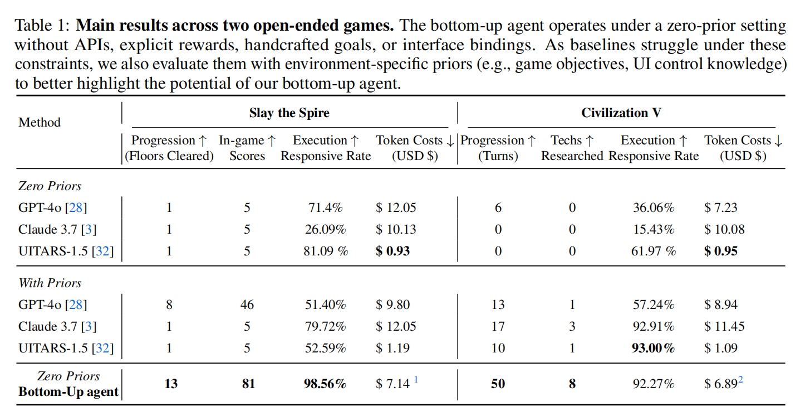

# BottomUpAgent


<div align="center" style="line-height: 1;">
<br>
<a href="https://arxiv.org/abs/2505.17673"><b>Paper Link</b>👁️</a>
</div>

## Introduction

This repository contains the official implementation of the paper  
**“Rethinking Agent Design: From Top-Down Workflows to Bottom-Up Skill Evolution”**.  
Our bottom-up agents learn skills through autonomous exploration and reasoning—starting from raw pixel inputs and simulated mouse/keyboard actions, evolving competence purely from experience.


## Project Highlights

- **Zero-prior Learning**: Agents operate without predefined goals, APIs, or game knowledge.  
- **Unified Codebase**: One framework supports multiple environments (e.g., Slay the Spire, Civilization V).  
- **Experience-Driven Evolution**: Skills are discovered, refined, and shared dynamically across agents.  
- **Visualization**: Execution states and skill libraries can be visualized via integrated GUIs and logs.

## Demo

| Environment         | Demo GIF                                           |
|:-------------------:|:---------------------------------------------------:|
| Slay the Spire      |  |
| Civilization V      |  |

## Table of Contents

- [Installation](#installation)  
- [Usage](#usage)  
- [Results](#results)  
- [Citation](#citation)  
- [License](#license)  

# installation

## 1.    aClone the repository 
```bash
git clone https://github.com/AngusDujw/Bottom-Up-Agent.git
cd Bottom-Up-Agent
```


## 2. Create & activate a Conda environment 
```bash
conda create -n bottomup python=3.10 -y
conda activate bottomup
```

## 3. Install dependencies
```bash
pip install -r requirements.txt
```

## 4. Configure API keys

Create a .env file inside the base_model/ directory with your LLM credentials:
```ini
# base_model/.env
OPENAI_API_KEY=your_openai_api_key_here
ANTHROPIC_API_KEY=your_anthropic_api_key_here
UI_TARS_API_KEY=your_ui_tars_api_key_her  # for ui-tars baseline
```

## 5. Configure Weights & Biases (wandb)

## 6. Download & configure the SAM model
  - Download the SAM weights (e.g., sam_vit_h_4b8939.pth) from the Segment Anything Model release.
  - Place the file under the root project’s weights/ folder:
    ```
    weights/
    └── sam_vit_h_4b8939.pth
    ```


# Usage
**⚠️ Note:** Before running the agent, make sure the game is already launched and you are at the in-game interface—starting from the main menu can cause the agent to spend excessive time exploring menus.

## Run on Slay the Spire
```bash
python -m run --config_file "config/sts_explore_claude.yaml"
```

## Run on Slay the Spire
```bash
python -m run --config_file "config/c5_explore_claude.yaml"
```


## Visualize
Open a separate terminal window before running the visualizer:
```bash
python BottomUpAgent/visualization.py
```
Once it’s up, visit http://localhost:8000 in your browser to explore skill trees, invocation logs


# Results

For detailed experimental results and further analysis, please refer to the full paper.

# Citation
If you use this code in your research, please cite:

```

```

# License
This project is licensed under the MIT License. See LICENSE for details.